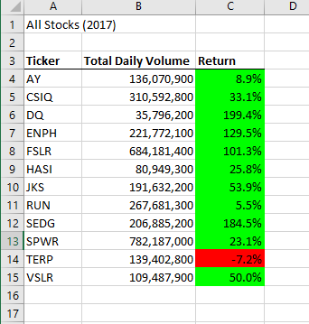
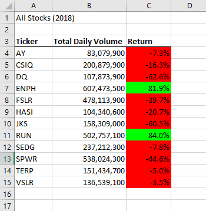
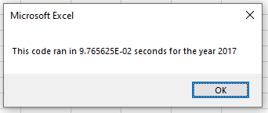
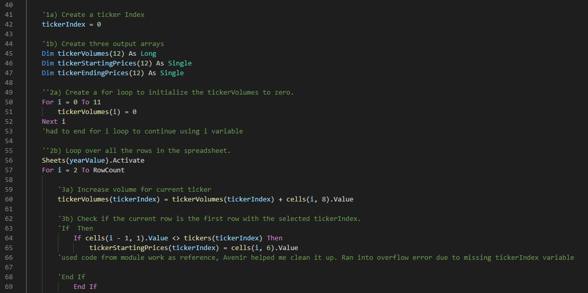
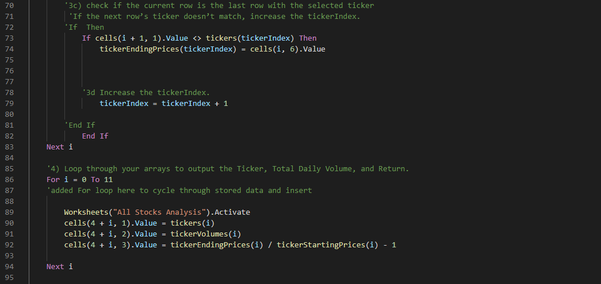

# An Analysis of Stocks and Refactoring Code to Be More Efficient 

In this analysis, We took a look at a sample of stocks and their returns from 2017 and 2018. Upon writing the code, we wanted to go back and refactor it, making it more efficient, and as a result, make the macro execution faster. I was successful in making the code more efficient, more stable, and less redundant, and more friendly to a larger data sample.

## The Results
### The Stock Performance
Lets take a look at the stock results first:

Since we are not adjusting the data, the stock outputs remain the same as before. It is clear that Steve should advise his parents to stay away from DQ stocks and instead should be investing in ENPH, as that stock has had two straight years of strong growth. RUN would have also been a good investment, although not as strong as ENPH. What we are really looking at here, however, is the run time of the macro. Below are the new run times of the refactored macro:

These run times are significantly improved from our original code, where my 2017 ran in 0.4513 seconds and my 2018 ran in 0.4502 seconds. From these new run times, it is evident that the refoactored macro not only accomplishes the same task, but is more efficient in doing so.

---
### The Refactoring

The main accomplishment of the refactoring is the removal of additional loops and nested loops. To achieve this, several arrays needed to be added to properly loop through rows and values. I also had to add a loop to output the data since our goal was to reduce nested loops. Removing the amount of iterations through data significantly reduced our run time and should be more friendly to expansion.

## Summary
There are many advantages and disadvantages to refactoring code, and those certainly apply to what we did here.
1. Advantages on refactoring include what we accomplished; reducing redundancy, increasing efficiency and stability, and making code more applicable to a larger sample size. Another advantage includes identifying bugs in the code. A cleaner code will also make collaboration more eficient, and also make future edits to the code perhaps come quicker and easier since the code is already uncluttered.
2. Disadvantages on refactoring were also directly experinced in this project. Refactoring a code that previously worked opened the door for new bugs to pop up. In fact, I had to collaborate with others to tackle these new bug, which can be costly in terms of time spent on a project. Time is precious in any role, and refactoring code can prove to be a serious time commitment. Another disadvantage, although more infrequent, could be the yield of the refactor. There could be an instance that, after much time spent on a refactor, it had minimal affect on the code/results.
3. In my experience, there were more pros than cons to our refactoring. The refactored code directly reduced the run time of the macro, which is what we set out to do. Although it did require a good amount of time and introduce new bugs, I was able to overcome the cons. The pros paid off, both in quicker run time, but also in making the code more versatile for Steve moving forward.  
