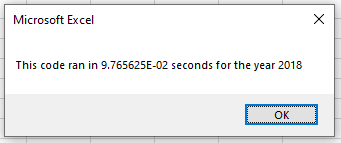

# An Analysis of Stocks and Refactoring Code to Be More Efficient 

In this analysis, We took a look at a sample of stocks and their returns from 2017 and 2018. Upon writing the code, we wanted to go back and refactor it, making it more efficient, and as a result, make the macro execution faster. I was successful in making the code more efficient, more stable, and less redundant, and more friendly to a larger data sample.

## The Results
### The Stock Performance
Lets take a look at the stock results first:

Since we are not adjusting the data, the stock outputs remain the same as before. It is clear that Steve should advise his parents to stay away from DQ stocks and instead should be investing in ENPH, as that stock has had two straight years of strong growth. What we are really looking at here, however, is the run time of the macro. Below are the new run times of the refactored macro:

These run times are significantly improved from our original code, where my 2017 ran in 0.4513 seconds and my 2018 ran in 0.4502 seconds. From these new run times, it is evident that the refoactored macro not only accomplishes the same task, but is more efficient in doing so.

---
### The Refactoring
